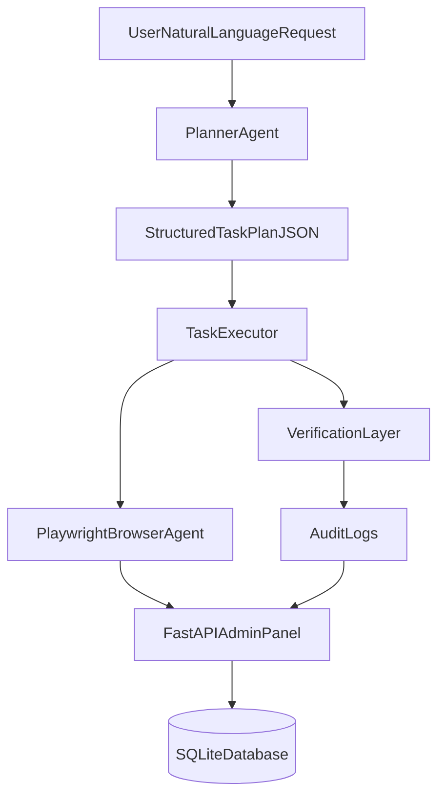

# DecaDesk AI

DecaDesk AI is an autonomous IT support agent that turns natural-language requests into browser-driven actions on a mock enterprise admin panel.

It simulates real IT workflows like password resets, user creation, license management, account deactivation, conditional flows, and batch operations with verification and audit logs.

## Architecture



## Tech Stack

- Python 3
- FastAPI + Jinja templates
- SQLite + SQLModel
- Playwright (browser automation)
- OpenAI API (planner reasoning, with heuristic fallback)

## Features

- User management: create user, view profile, reset password, status update
- License management: assign/revoke Microsoft 365, Slack, Notion
- Audit logs: every important action recorded with status and details
- Role-aware behavior: `SUPER_ADMIN`, `IT_SUPPORT`, `HR_ADMIN`, `VIEWER`
- Chat trigger UI for natural-language request execution
- Conditional workflow: check-if-exists then create + assign licenses
- Batch workflow: disable accounts inactive for N days

## Project Structure

```text
app/
  main.py
  db.py
  models.py
  routes.py
  services.py
  templates/
  static/
agent/
  prompts.py
  planner.py
  browser_agent.py
  executor.py
  cli.py
scripts/
  seed_demo.py
requirements.txt
```

## Setup

1. Create virtual environment and install dependencies:

```bash
python -m venv .venv
.venv\Scripts\activate
pip install -r requirements.txt
python -m playwright install chromium
```

2. Configure environment:

```bash
copy .env.example .env
```

Set `OPENAI_API_KEY` in `.env` for LLM planner mode.

3. Seed demo data:

```bash
python scripts/seed_demo.py
```

4. Start app:

```bash
uvicorn app.main:app --reload
```

Open `http://127.0.0.1:8000/dashboard?role=IT_SUPPORT`

## Demo Scenarios

1. Reset password:
`Reset password for john@company.com`

2. Create user:
`Create a new user named Sarah with email sarah@company.com in Engineering and assign Microsoft 365`

3. Conditional workflow:
`Check if alex@company.com exists. If not, create the account and assign Slack and Microsoft 365.`

4. Batch workflow:
`Disable all accounts inactive for 90 days`

## Chat + Agent Execution

- Go to `Helpdesk Chat`
- Enter a request
- Click `Run in browser`
- Review summary and execution logs in UI

You can also run from terminal:

```bash
python -m agent.cli
```

## Deployment Notes

- Deploy FastAPI app to Railway/Render
- Use environment variables for:
  - `OPENAI_API_KEY`
  - `OPENAI_MODEL`
  - `DECADESK_BASE_URL`
  - `DECADESK_HEADLESS`
- Ensure Playwright Chromium runtime is installed in the deployment image


## Future Improvements

- True auth + session-based RBAC
- Better multi-tenant org modeling
- More robust UI reasoning via screenshot-grounded CUA
- Background workers for long-running batch tasks
- Slack/Teams inbound integration

